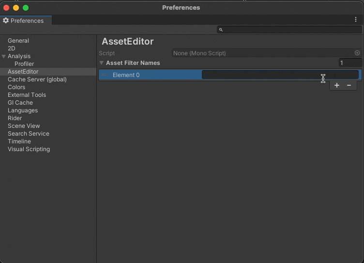
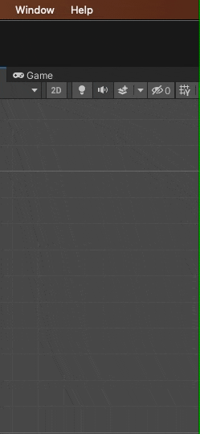
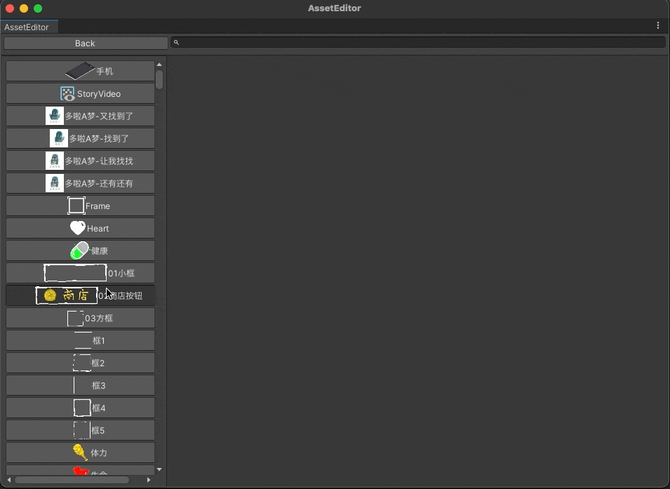

# AssetEditor资源编辑器
## _Unity AssetEditor，Improve your editor workflow_
- ## _Unity 资源编辑器，改善你的编辑器工作流_
AssetEditor is a unity editor plugin, allow you to manage your asset, and custom your workflow
- ### 资源编辑器是一个Unity编辑器插件，允许您管理您的资产，并自定义您的工作流程
***
## Features
- Manage your UnityAsset in AssetEditor
- - 在资源编辑器中管理你的 Unity资源
- Manage your custom ScritableObject
- - 管理你自定义的ScritableObject
- Improve your editor workflow
- - 改善你编辑器的工作流

# Tutorial教程

## First step, add Asset Type name in preference
- 第一步，在首选项中添加资源类型名称

***
## Second step，open Asset Editor
- 第二步，打开资源编辑器

***
## Third step，manage different types Assets
- 第三步，管理你不同类型的资源

***
## Fourth step, layout to custom your workflow
- 第四步，布局以自定义您的工作流程

***

# Introduce video on bilibili
## 哔哩哔哩上的介绍视频

<iframe src="//player.bilibili.com/player.html?aid=547789329&bvid=BV1vq4y1T7Yg&cid=404426061&page=1" scrolling="no" border="0" frameborder="no" framespacing="0" allowfullscreen="true"> </iframe>

***
## License
GPT 3.0