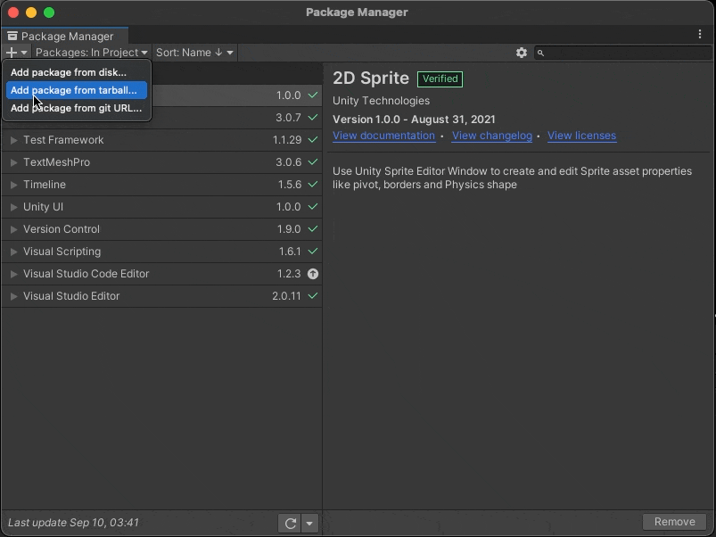

# **AssetEditor资源编辑器**
## _Unity AssetEditor，Improve your editor workflow_
- ## _Unity 资源编辑器，改善你的编辑器工作流_
AssetEditor is a unity editor plugin, allow you to manage your asset, and custom your workflow
- ### 资源编辑器是一个Unity编辑器插件，允许您管理您的资产，并自定义您的工作流程

## **using Unity UIElements(使用Unity UIElements编写)**
## **Lightweight tool(轻量级工具)**

# **[CHANGELOG](CHANGELOG.md)**

***
## **Features**
- Manage your UnityAsset in AssetEditor
- - 在资源编辑器中管理你的 Unity资源
- Manage your custom ScritableObject
- - 管理你自定义的ScritableObject
- Improve your editor workflow
- - 改善你编辑器的工作流
***

## **Install安装**
**Open Package Manager Click + (打开包管理器点击+号)**

**Add package from git URL (从git地址中添加包裹)**

**Paste URL(粘贴URL)**
```
https://github.com/LONEStudio/AssetEditor.git
```
**Click Add(添加添加)**


***
# **Tutorial教程**

## **First step, add Asset Type name in preference**
- 第一步，在首选项中添加资源类型名称


***
## **Second step，open Asset Editor**
- 第二步，打开资源编辑器


***
## **Third step，manage different types Assets**
- 第三步，管理你不同类型的资源

***
## **Fourth step, layout to custom your workflow**
- 第四步，布局以自定义您的工作流程

***

# **[Introduce video on bilibili (哔哩哔哩上的介绍视频)](https://www.bilibili.com/video/BV1vq4y1T7Yg)**
***
# License
- **GPT 3.0**